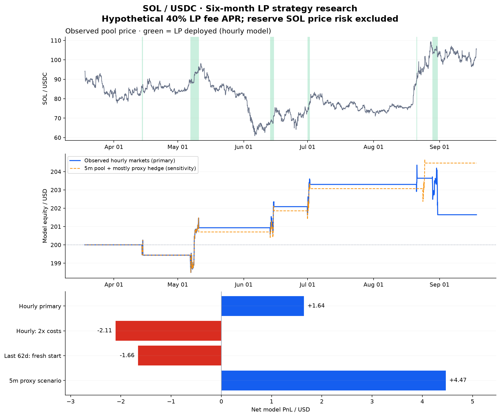

# SOL / Meteora 六个月策略研究：40% 假设手续费 APR

**找到六个月样本内盈利候选，未找到足以证明稳定盈利的方案。默认仅模拟。**

时间为 **2026-03-18 08:00 UTC 至 2026-09-18 08:00 UTC（不含终点）**，共184天；北京时间两端均为16:00。池子为 `5rCf1DM8LjKTw4YqhnoLcngyZYeNnQqztScTogYHAS6`，SOL/USDC，bin step 4 bps。

## 主要结果

总预算200美元，调整为 **LP100 / Hyperliquid40 / 租金与备用60**。主结果使用全覆盖的真实池子与真实 Hyperliquid **小时价格**。六个月模型净收益 **+1.6446美元（0.822%）**，其中假设 LP 手续费 **1.1189美元**，其余库存、对冲、资金费和列示执行成本合计 **+0.5258美元**。

主模型持有LP约 **246小时 / 10.25天**，有 **12次建/撤仓工作流，约6轮进出**，大部分时间持有报价币。它保留 SOL 方向性敞口，不是完全 Delta 中性的手续费套利。

**最后62天从空仓独立起始测试亏损 -1.6577美元；主回测成本翻倍后亏损 -2.1055美元。不能据此保证实盘获利，也不能把40% LP年化理解为整个200美元账户年化40%。**

| 场景 | 净收益 USD | 假设LP费 USD | 模型最大回撤 |
|---|---:|---:|---:|
| 真实双市场小时价格，40% APR | +1.6446 | 1.1189 | 1.327% |
| 小时价格，执行成本翻倍 | -2.1055 | 1.1160 | 1.847% |
| 小时价格，30% APR | +1.3646 | 0.8391 | 1.363% |
| 最后62天独立起始测试 | -1.6577 | 0.3030 | 1.349% |
| 5分钟池价格 + 合约代理 | +4.4677 | 0.9158 | 0.900% |
| 5分钟低点优先情景 | +4.4943 | 0.9154 | 0.909% |
| 5分钟低点优先 + 双倍成本 | +1.5303 | 0.9126 | 1.269% |

最后62天独立测试会重新初始化资金、冷却和仓位；它不是完整六个月曲线的末段差值，不能与此前各段收益相加。低点优先是一个可行情景，不是所有逐笔路径的最坏上界。



## 收益如何入账

每个价格区间的手续费 = **该段实际LP本金 × 0.40 × 在区间内小时数 ÷ 8760**。本金取区间起止市值较低者；一根观察K线的高低点越出LP范围，则该根不计手续费。资金未部署、退出、数据缺口期间均为零；只在下一个决策前入账，参与净值与熔断。费用不自动追加到LP本金，不按APY复利计算。

40%是用户指定的**LP到账手续费 APR 假设**，不是该池历史测得的个人收益；未再额外扣一次协议分成。研究已扣：合约执行费及滑点 **0.6971美元**，换币成本 **1.8421美元**，链上工作流 **1.2000美元**。历史资金费贡献 **+0.0275美元**。

模型按合约 taker 4.5 bps + 3 bps滑点计费，没有用“所有 maker 挂单都能成交”来提高收益；线上仍复用 maker 优先、撤单核对、紧急IOC的执行器。建仓换入WSOL后，临时全额对冲、添加LP、再降低对冲比例的额外成交费已计入。换币34bps、每次LP工作流0.10美元为假设；期末强制撤LP、卖出库存、平空也计费。

## 固定参数与退出条件

- 单个主区间：价格P附近 **[P/1.15, P×1.15]**，约下方13.04%、上方15%，按bin对齐，不频繁追价。
- 入场：已闭合小时收盘价高于EMA96；过去168小时上涨至少6%；EMA144不下降；通过波动、急跌和价差检查；连续观察6个符合条件的闭合小时。首次也不跳过趋势检查。
- 区间内：做空 **LP实际SOL库存的25%**，钱包WSOL余量另外对冲；3倍逐仓仅决定保证金，不把对冲数量再乘3。
- 下跌退出：收盘价低于EMA48、EMA48低于EMA144且两者下降；或收盘低于EMA144的99.5%且EMA144下降；任一成立即退出。
- 大波动退出：最近24个小时收益的标准差超过0.8%，或最近6小时/此前168小时波动率比超过2.5，或上一小时高低振幅超过5%。
- 急跌/实时保护：上一完整小时跌幅超过3%，或当前价相对上一小时收盘跌超3%；小时内绝对位移超过5%也退出。池/合约价差超过1%退出。
- 任意一边越界：退出并等待；不立即在新价格重建。退出后冷却 **168小时（7天）**，冷却结束还必须重新满足趋势条件和6个健康小时。
- 组合高水位回撤5%：保持熔断。重启不会清掉冷却、建仓历史或熔断；重复WS消息不会增加健康小时。

## 数据质量与适用边界

- 4416根池小时K线、4872根Hyperliquid小时K线（含19天预热）、4416个资金费小时：无缺失、重复或无效OHLC。资金费原始结算比整点晚数毫秒，按所属小时核对完整性，保留原始时间戳。结算归到决策前已有的空单；费率从不作为未来可知的信号。
- 池5分钟数据52991根，缺1根：2026-08-15 20:00 UTC。未补造价格；跨缺口不计费，并在下一次可观察价格退出后重新冷却。
- **五分钟 Hyperliquid 只有4995根真实记录，另47996根使用该小时开盘已知基差乘池价格的代理。约90.6%是代理，所以五分钟结果仅作敏感性检查，主结论必须用完整真实双市场小时数据。**
- 小时模型看不到线上15秒响应；五分钟低点优先也不是逐笔成交。DLMM账本为离散等值bin近似，线上按SDK Spot配置和真实仓位余额执行；历史bin竞争份额和maker排队仍不可得。
- 可退还租金未作为费用消耗。此区间约701 bins，按本次RPC租金表，position约 **0.400873 SOL**；加0.03 SOL gas底仓与0.004 SOL账户余量，在样本最高价下约 **48.05美元**，60美元预留满足初始预算检查。实际签名前仍需模拟，未知bin array创建费会阻止超预算交易。
- **备用资金按固定美元估值；未计实际备用/租金SOL币价变化、兑换/退款价差、节点订阅费、交易失败/延迟/MEV和USDC脱锚。** 没有独立的逐仓清算模拟器。这个微利候选对遗漏成本敏感，不能称为已验证的线上净利润。
- 总共仅约6轮进出，交易样本很少。多轮开发中查看过不同候选的后段表现；最后62天未进入最终参数打分，但不是完全盲测。所有中间结果保留，不能称为无偏样本外验证。

可核对源数据前三行（池小时，UTC）：

| 时间 | 开 | 高 | 低 | 收 |
|---|---:|---:|---:|---:|
| 2026-03-18T08:00:00+00:00 | 93.9749 | 94.2384 | 93.9749 | 94.0501 |
| 2026-03-18T09:00:00+00:00 | 94.0501 | 94.4270 | 94.0125 | 94.2761 |
| 2026-03-18T10:00:00+00:00 | 94.2761 | 94.4270 | 93.5999 | 93.8623 |

## 工程实现与复现

- `src/solana/regime.rs`：独立SOL策略状态机与风控，RPC/签名之外的纯Rust计算。
- `src/solana/research/data.rs`、`simulation.rs`、`search.rs`、`verification.rs`：分别负责数据校验、资金与手续费账本、选参、细粒度敏感性。
- `config/solana-regime.toml`：固定候选，默认paper，独立状态目录 `data/solana-regime-paper`。不修改已有 `config/solana.toml` 或EVM配置。
- `src/solana/runner.rs`：只有显式 `[regime]` 才走新逻辑；旧配置继续原策略。身份指纹阻止把新参数套到旧状态。
- 新策略实盘读取实际待领LP手续费，**不会把假设40%写入真实账户净值**。在线paper仍明确标注未计实际LP费/资金费，40%假设只在离线research命令生效。
- Solana链上指令仍经已隔离的官方Meteora SDK桥接；决策、回测、风控、日志、重启状态与Hyperliquid管理在Rust。EVM运行不需要该Node桥接。

```bash
cargo build --release --locked
./target/release/lp-maker-solana --config config/solana.toml research \
  --data backtests/solana/2026-09-18-six-month \
  --grid backtests/solana/2026-09-18-six-month/accepted-parameters.json \
  --apr 0.4 --output /tmp/solana-hourly-replay.json
./target/release/lp-maker-solana --config config/solana-regime.toml verify-research \
  --data backtests/solana/2026-09-18-six-month \
  --apr 0.4 --output /tmp/solana-fine-replay.json
```

第一条是固定候选复算；`grid-round-4.json`保存开发期搜索空间，中间轮次也全部保留。报告使用 `accepted-hourly.json` / `accepted-fine.json`；更早的探索输出可能尚未补计临时全额对冲周转费，不应作为最终收益。

Triton One名称已确认；尚需账户完整RPC/gRPC地址。未使用猜测的认证地址，未用用户私钥签名、未广播任何真实交易。实时监听和完整交换流程仍需在提供端点后验证。

来源：[Meteora Data API](https://dlmm.datapi.meteora.ag/swagger-ui/)、[Meteora官方SDK](https://github.com/MeteoraAg/dlmm-sdk)、[Hyperliquid Info API](https://hyperliquid.gitbook.io/hyperliquid-docs/for-developers/api/info-endpoint)、[Triton Yellowstone](https://docs.triton.one/project-yellowstone/dragons-mouth-grpc-subscriptions)。公开原始响应哈希见 `manifest.json`，本次报告输入和代码哈希见 `evidence.json`。
