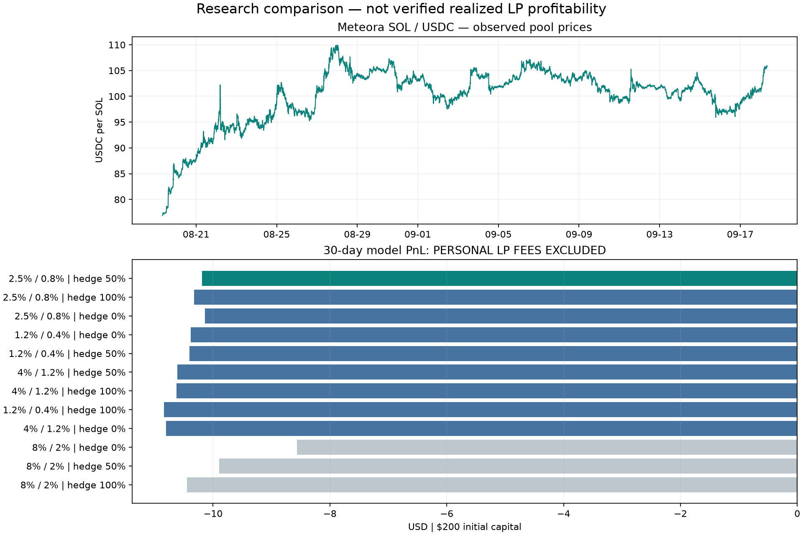

# SOL/USDC Meteora DLMM：30 天策略研究

时间：**2026-08-19 08:00 UTC 至 2026-09-18 08:00 UTC**，结束时间不包含在样本内。北京时间为 8 月 19 日 16:00 至 9 月 18 日 16:00。

## 结论

**没有足够证据确认“最近一个月最赚钱的 LP 策略”。** 这里比较的是 12 组参数的近似模型；历史逐 bin 竞争流动性、个人份额和 Hyperliquid 挂单队列不可得，因此实际个人手续费和 maker 成交无法精确还原。模型结果不足以支持直接实盘。

按此前 **200 美元总预算（LP 120 / Hyperliquid 60 / 备用 20）**，先筛掉初始租金不满足预算的配置，再以训练期“未计个人 LP 费损益 − 2×美元最大回撤”选择候选，得到主区间约 **±2.5%**、辅助约 **±0.8%**、区间内对冲 **50%** 的 SOL 库存。对冲比例乘 LP 的实际 SOL 数量，不乘 3 倍杠杆；钱包 WSOL 余量另外对冲。

- 30 天模型损益：**-10.19 美元（-5.09%），未计个人 LP 手续费**。
- 最大模型回撤：5.09%；月内触发 Halted；该配置在未计 LP 费的模型里不能持续运行整月。
- 收支平衡至少需要覆盖 **10.19 美元**的个人 LP 费；实际是否达到未知。
- 后 9 天独立起始、相同参数测试：-6.65 美元，未计 LP 费。这是重新从 200 美元和初始状态开始的独立测试，不能与前 21 天损益相加。
- 不参与 LP、现金不计利息的基准是 0 美元；在确认实际手续费覆盖损耗前，该基准值得保留。



图中绿色为训练期选中的预算可行候选，灰色为租金超出预算的配置；全部损益条形均未计个人 LP 费。

## 数据与质量

池地址：`5rCf1DM8LjKTw4YqhnoLcngyZYeNnQqztScTogYHAS6`；SOL/USDC，SOL 9 位、USDC 6 位，bin step 4 bps。元数据与原始响应保存在本目录。

| 数据 | 覆盖 | 处理 |
| --- | --- | --- |
| Meteora 5 分钟池 K 线 | 8640 根，缺失 0 | 原样保留，不补价格 |
| Hyperliquid 小时 K 线 | 912 根，含 8 天指标预热 | 整月主比较使用小时级观察 |
| Hyperliquid 5 分钟 K 线 | 4995 根，缺失 3645 | 仅做共同覆盖区间敏感性检查 |
| Hyperliquid SOL 资金费 | 720 条 | 分页获取，持有的空单按正资金费收取 |
| Meteora 池总手续费 | 8640 条 | 103 个 5 分钟窗口费用接口零量但 K 线有量，标为不完整；不补成“实际零费用” |
| 历史每 bin 资金份额 / maker 队列 | 无 | 不计算声称精确的个人收益 |

主比较只使用每小时已知的开盘价格和此前已完成 K 线，预热数据不计入收益。期末按最后完整 K 线收盘估值，不产生新交易。小时采样把 2 小时突破确认近似为 2 次小时观察，无法还原线上 15 秒响应或小时内先跌后涨的路径。

5 分钟共同覆盖期：2026-08-31 23:45 UTC 至 2026-09-18 08:00 UTC，候选损益 -10.19 美元、回撤 5.10%，未计个人 LP 手续费。该区间与训练期重叠，属于采样频率敏感性检查，**不是独立样本外验证**。

## 参数比较

所有金额列均为“未计个人 LP 手续费”的模型值。其余快跌、波动率、趋势、6 小时恢复与 5% 熔断规则固定，未为收益逐项调优。前 21 天用于参数选择；后 9 天不参与打分。

| 主区间半宽 | 辅助半宽 | 区间内对冲 | 初始租金预算可行 | 前21天损益USD | 后9天独立测试USD | 30天损益USD | 30天最大回撤 |
| --- | --- | --- | --- | --- | --- | --- | --- |
| 2.5% | 0.8% | 50% | 是 | -10.19 | -6.65 | -10.19 | 5.09% |
| 2.5% | 0.8% | 100% | 是 | -10.32 | -6.79 | -10.32 | 5.16% |
| 2.5% | 0.8% | 0% | 是 | -10.14 | -6.79 | -10.14 | 5.21% |
| 1.2% | 0.4% | 0% | 是 | -10.38 | -7.81 | -10.38 | 5.19% |
| 1.2% | 0.4% | 50% | 是 | -10.40 | -7.71 | -10.40 | 5.20% |
| 4% | 1.2% | 50% | 是 | -10.61 | -5.99 | -10.61 | 5.31% |
| 4% | 1.2% | 100% | 是 | -10.63 | -6.02 | -10.63 | 5.31% |
| 1.2% | 0.4% | 100% | 是 | -10.84 | -8.00 | -10.84 | 5.42% |
| 4% | 1.2% | 0% | 是 | -10.80 | -5.76 | -10.80 | 5.92% |
| 8% | 2% | 0% | 否 | -8.57 | -4.93 | -8.57 | 5.27% |
| 8% | 2% | 50% | 否 | -9.89 | -5.13 | -9.89 | 5.03% |
| 8% | 2% | 100% | 否 | -10.45 | -5.13 | -10.45 | 5.22% |

## 费用敏感性：假设，不是已赚到的收益

对每个可比时间段，假设全部池手续费在当时活跃 bin 分配，用模型中的自身活跃 bin 资金与一个固定的竞争资金量计算份额。实际交易会跨多个 bin，此假设没有历史份额验证；当前 TVL 也没有被当成历史资金量。缺失手续费窗口整段排除。

| 假设其他人活跃 bin 资金 USD | 假设个人累计 LP 费 USD | 模型损益 + 假设 LP 费 USD |
| --- | --- | --- |
| 5,000 | 13.51 | 3.32 |
| 25,000 | 2.70 | -7.49 |
| 100,000 | 0.68 | -9.51 |

这张表仅说明结论对资金份额有多敏感。假设手续费不回写模型的仓位、恢复或熔断，因此最后一列也不是完整的有手续费策略重跑结果。

## 成本与执行边界

- DLMM 研究账本使用离散等值 bin、跨价格时按 bin 固定价转换库存；实盘使用官方 SDK Spot 分布和真实 active-bin 库存。两者不是逐笔一比一复制。
- 合约基准按 taker 4.5 bps 加 3 bps 滑点估算；另有 maker 1.5 bps 乐观费用情景，但它假设成交，不能证明 maker 能按时填单。线上仍是 maker 优先，紧急时 IOC。
- 换币按 34 bps 成本假设；每次 LP 工作流按 0.10 美元 Gas/优先费假设。回测的增仓用重建近似并收费，实盘增加原仓位。
- 已计合约执行成本 0.6634 美元、换币成本 3.3739 美元、链上工作流成本 2.6000 美元；资金费贡献 0.0132 美元。
- 账户租金是可退还的锁定资金，未当作手续费损耗。用当前 RPC 租金表检查初始资金可行性；未还原历史租金变化、未建 bin array 的租金和退款价格变化。线上模拟会核对实际增量租金。
- USDC 按 1 美元；20 美元备用金按固定美元计价，不模拟备用 SOL 币价或逐笔 Gas 对净值的影响。
- SOL 数量步长按 0.01 的研究假设，实盘读取 Hyperliquid meta；保留最低名义金额与死区。未建立独立清算引擎，3 倍保证金只是预算约束，不能证明不会清算。
- 这是报价币净值模型，未计个人 LP 费、期末强制平仓费、出入金、网络延迟、MEV、交易失败成本、USDC 脱锚等影响。

## 策略落地

默认配置为 `config/solana.toml`，paper 模式。每层范围按 bin 对齐，以参考价 P 的 `[P/(1+w), P*(1+w)]` 为近似中心范围；不会把今天的绝对价格硬编码为未来区间。

主区间权重 2/3，辅助 1/3；默认观察 15 秒、中文摘要 60 秒。保留下沿保护、1% 额外突破缓冲、8 个 15 分钟观察、快跌/波动率/下降趋势暂停、后续恢复冷却 6 小时与分批恢复。候选主区间 125 bins，辅助 41 bins（实际边界随中心价变动）。

按本次 RPC 租金观察，两个 position 约需 0.1150 SOL，另外保留至少 0.03 SOL Gas 与账户创建余量。该数值是资金占用估计，实际以签名前模拟为准。

## 复现

```bash
python3 scripts/solana/fetch_history.py --end 2026-09-18T08:00:00Z --output backtests/solana/2026-09-18
cargo run --locked --bin lp-maker-solana -- --config config/solana.toml backtest --data backtests/solana/2026-09-18 --output backtests/solana/2026-09-18/results.json
```

下载器缓存原始响应并记录 SHA-256。该历史窗口的 5 分钟数据会随着服务端保留期推进而进一步缩短，保留本次原始响应比重新下载更适合审计。运行回测不读取钱包私钥，不连接链上交易接口。

## 来源

- [Meteora DLMM Data API](https://dlmm.datapi.meteora.ag/swagger-ui/)：池元数据、OHLCV、池总手续费。
- [Meteora 官方 DLMM SDK](https://github.com/MeteoraAg/dlmm-sdk)：bin、Spot 配比、position 账户大小及建仓指令。
- [Hyperliquid Info API](https://hyperliquid.gitbook.io/hyperliquid-docs/for-developers/api/info-endpoint)：价格、资金费和历史保留/分页限制。
- [Hyperliquid 费率](https://hyperliquid.gitbook.io/hyperliquid-docs/trading/fees)：研究费率参考，实际费率取决于账户等级。
