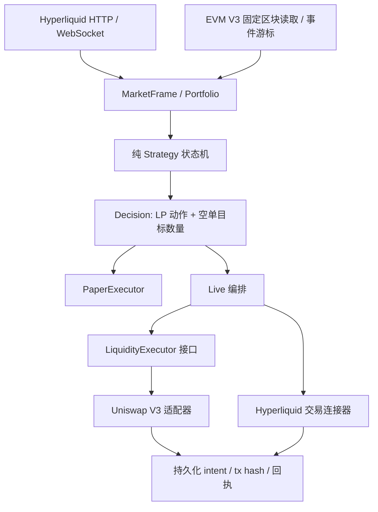

# 架构与执行语义

策略 `Warmup → Active → Paused → Recovering → Active`；账户回撤可以从任意状态进入 `Halted`。低波动慢跌和高波动快跌分开判断。暂停没有超时自动重建。连续计数只在新完成小时或新观察边界更新；缺失观察清零。

平台接口有三层：`LiquidityVenue` 读取，`LiquidityExecutor` 修改库存/流动性，`HedgeVenue` 读取与合约订单。Live LP 编排依赖 `dyn LiquidityExecutor`，链 ID、手续费级别、token0/1 排序、NFT 和 ABI 均留在 V3 适配器内。当前启动工厂只注册 V3，避免未知协议被错误识别成 V3。

## 订单流程

1. 用账户所有者/子账户地址读取持仓，不能用 API agent 地址代替。
2. 目标空单减实际空单得到增减数量；杠杆只用于保证金预算。
3. 读取当下深度，按资产元数据验证精度与最小名义金额。
4. 写入 Cloid/nonce/过期时间和操作意图，然后发送签名请求。
5. ALO 挂单等待、查询订单、取消尚未成交部分；重新读取真实持仓。
6. 紧急状态对剩余数量使用有价格限制的 IOC。减空单使用 Reduce Only。
7. 未知响应留在 pending；HTTP 200 内的交易错误也作为失败处理。

普通 Maker 不保证成交，成交历史和账户仓位才是事实。订单修改后也不能假设旧订单没有成交。当前执行器顺序执行，单个状态目录使用进程锁；同一账户不要运行其他执行程序。不同目录不构成跨进程钱包锁。

## LP 交易流程

- 读取、校验链 ID、代码、token0/1、fee、factory、注册池地址和精度。
- 把策略价格转换为 ticks，负 ticks 向外对齐；兼容 base 是 token0 或 token1。
- NFT 增减使用原始整数流动性，代币 calldata 为 U256，浮点只用于策略与报价计算，转链上单位向下截断。
- 按实际所需金额授权，不使用无限额度。新交易先 eth_call，再估 gas、检查原生余额与 gas 预算。
- 发送前落盘签名交易及哈希。收据成功、达到确认数且所在区块仍在规范链后才提交本地状态。
- mint 的 NFT Transfer 在清除 pending 之前进入注册表；撤出通过单笔 NFPM multicall 执行 decrease + collect + burn。
- 执行中途恢复从实际链上状态继续核对，不重新发送“上一轮 mint”。

池监听每次最多查询 2,000 块，并持久化最后已消费区块哈希。日志写入和游标提交之间宕机可能造成重复输出，消费者按 `(blockHash, logIndex)` 去重；发生重组时停机提示从确认快照重建，不静默继续使用旧游标。

## 非原子性与恢复

平台之间的成交顺序无法组成单笔原子交易。LP 换币后实际 ETH 数量变化，到空单相应成交之前可能出现短暂净敞口。maker、IOC、RPC 和链上确认都可能失败。程序选择停止新增、保留操作状态，而不是冒险复制订单。

- `pending.json`：单个未确认网络写操作。
- `workflow.json`：跨多个写操作的 LP 调整。
- `nfts.json`：层名称到 NFT ID 的登记。
- `hedge_order.json`：订单目标与 Cloid，用于定位未完成挂单。
- `checkpoint.json`：权威版本化检查点；paper 的阶段、余额、仓位、待成交单一次原子提交。
- `strategy.json` / `paper.json`：检查点的兼容导出，启动时可由权威检查点修复。
- `orders.json` / `open_orders.json`：本程序订单台账和实际挂单快照。
- `live_inventory.json`：实际 LP、钱包和永续仓位的最近观察，变化追加审计记录。
- `startup_reconciliation.json`：启动检查阶段、订正详情与阻塞原因。
- `config.json`：配置指纹；已有运行目录拒绝不兼容配置变更。
- `events.jsonl`：追加日志，需运维自行保留/轮转。

`reconcile` 不会对不确定的存款/保证金结果作成功假设；此类无法确定的写操作保持阻塞。对于仍未上链的 EVM 交易，按原哈希等待，nonce 替换、gas bump 或手工取消需要额外核对，不在本版自动化范围内。

实盘启动会先自动对账；明确属于策略的遗留对冲挂单会撤销剩余委托，再以实际持仓计算新目标。未知/手工订单、未知订单状态、缺失 NFT 映射均阻止自动继续。恢复不会清除回撤停机状态。详见 [状态持久化与启动对账](recovery.md)。
